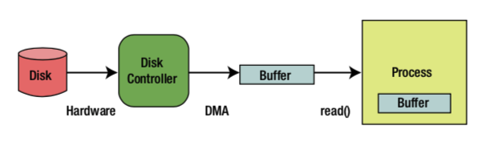

# Buffer（缓冲区）

- 容量(Capacity)：缓冲区能够容纳的数据元素的`最大数量`。这一容量在缓冲区创建时被设定，并且永远不能被改变。
- 上界(Limit)：缓冲区的`第一个不能被读或写的元素`。或者说，缓冲区中现存元素的计数。
- 位置(Position)：`下一个要被读或写的元素`的索引。位置会自动由相应的 get()和 put()函数更新。 
- 标记(Mark)：一个备忘位置。调用mark()来设定mark=postion。调用reset()设定position=mark。标记在设定前是未定义的(undefined)。

这四个属性之间总是遵循以下关系:
```0 <= mark <= position <= limit <= capacity```


