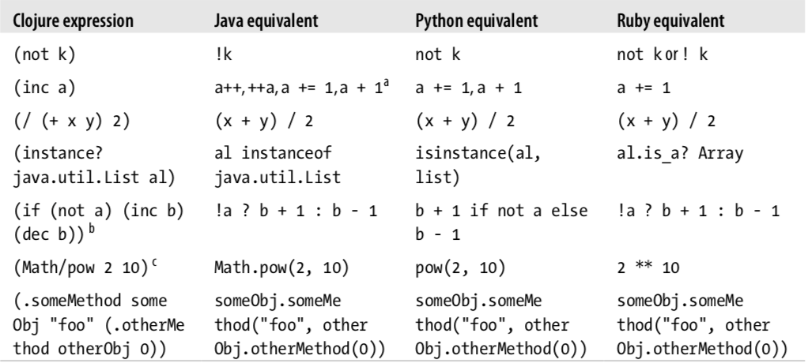
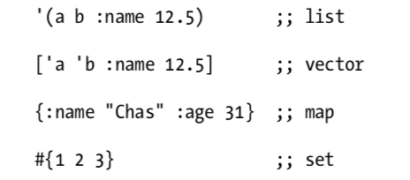
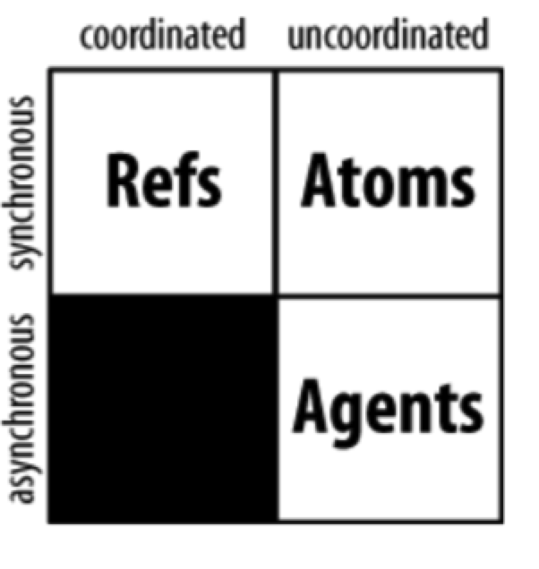

# Clojure

## Clojure 语法

--- 

## Clojure 集合

---

## 集合操作

---

## 并发操作

- Coordination. A coordinated operation is one where multiple actors must cooperate (or, at a minimum, be properly sequestered so as to not interfere with each other) in order to yield correct results.

- Synchronization. Synchronous operations are those where the caller’s thread of execution waits or blocks or sleeps until it may have exclusive access to a given context, whereas asynchronous operations are those that can be started or scheduled without blocking the initiating thread of execution.

