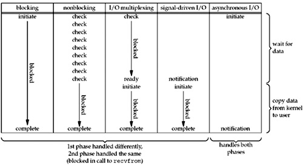

# I/O模型

- 阻塞I/O
- 非阻塞I/O
- I/O复用（select、poll、linux 2.6种改进的epoll）
- 信号驱动IO（SIGIO）
- 异步I/O（POSIX的aio_系列函数）

- 传统的Java BIO (blocking I/O)是Unix I/O模型中的第一种。
- Java NIO中如果不使用select模式，而只把channel配置成nonblocking则是第二种模型。
- Java NIO select实现的是一种多路复用I/O，底层使用epoll或者相应的poll系统调用。
- 第四种模型JDK应该是没有实现。
- Java NIO2增加了对第五种模型的支持，也就是AIO。
