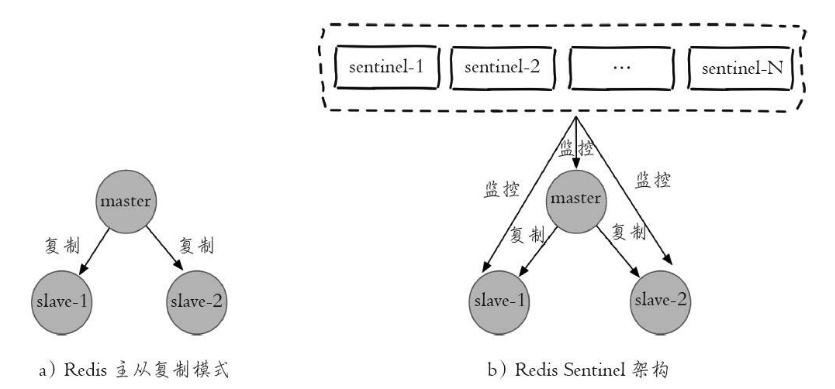

# Redis哨兵模式



Sentinel节点本身就是独立的Redis节点，只不过它们有一些特殊，它们不存储数据，只支持部分命令：ping、sentinel、subscribe、unsubscribe、 psubscribe、punsubscribe、publish、info、role、client、shutdown。

启动命令：

```shell
redis-sentinel redis-sentinel-26379.conf
redis-server redis-sentinel-26379.conf --sentinel
```
