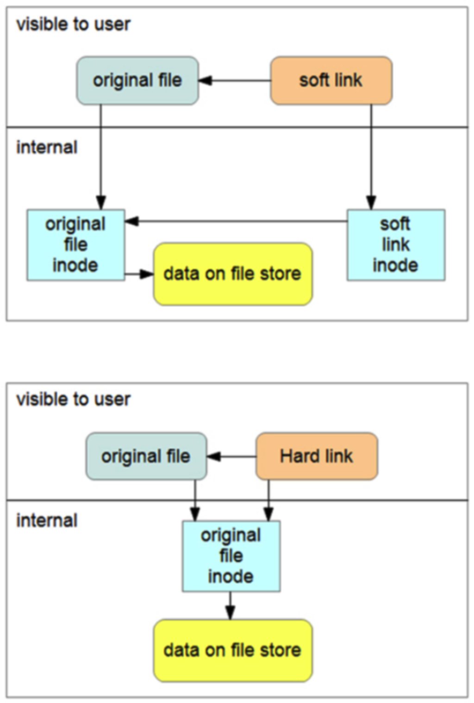

# Soft Link & Hard Link

- A `symbolic link` (soft link or symlink) is a special file that references another file. Symbolic links are typically invisible to applications; operations on symbolic links are automatically `redirected` to the link’s target (the file or directory being pointed to), except for when a symbolic link is deleted or renamed, in which case it’s the link that’s deleted or renamed and not the target.

- A `hard link` is a directory entry that associates a name with a file on a file system. It’s basically the `same` entity as the original file. All attributes are identical: they have the same file permissions, timestamps, and so on.

For a soft link, the file points to an inode and the soft link points to another inode. The soft link inode references the file inode, which points to the data on the file store. For a hard link, both the file and the hard link point to the file inode, which points to the data on the file store.

