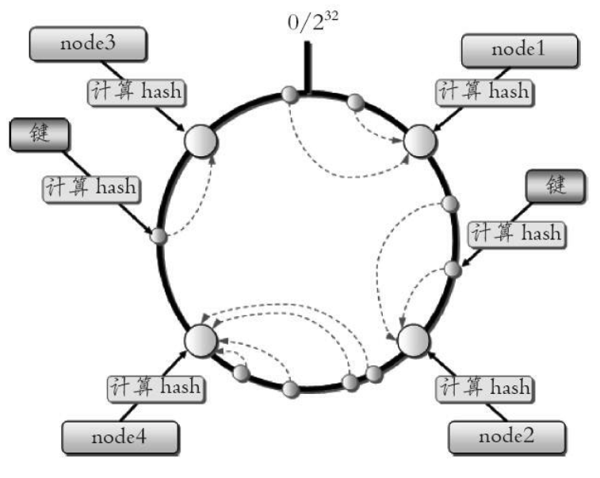

# 一致性哈希

## 一致性哈希

一致性哈希分区（Distributed Hash Table）实现思路是为系统中每个节点分配一个token，范围一般在0~232，这些token构成一个哈希环。数据读写执行节点查找操作时，先根据key计算hash值，然后顺时针找到第一个**大于等于**该哈希值的token节点。

优点：
加入和删除节点只影响哈希环中相邻的节点，对其他节点无影响。

缺点：
- 加减节点会造成哈希环中部分数据无法命中，需要手动处理或者忽略这部分数据，因此一致性哈希常用于缓存场景。
- 当使用少量节点时，节点变化将大范围影响哈希环中数据映射，因此这种方式不适合少量数据节点的分布式方案。
- 普通的一致性哈希分区在增减节点时需要增加一倍或减去一半节点才能保证数据和负载的均衡。

---

## 虚拟槽分区

虚拟槽分区巧妙地使用了哈希空间，使用分散度良好的哈希函数把所有数据映射到一个固定范围的整数集合中，整数定义为槽（slot）。Redis Cluster槽范围是`0~16383`，每一个节点负责维护一部分槽以及槽所映射的键值数据。

Redis集群一般由多个节点组成，节点数量至少为**6**个才能保证组成完整高可用的集群。每个负责处理槽的节点应该具有从节点，保证当它出现故障时可以自动进行故障转移。

### Gossip协议

运行在集群模式下的节点通过**Gossip协议**彼此通信（工作原理就是节点彼此不断通信交换信息，一段时间后所有的节点都会知道集群完整的信息，这种方式类似流言传播），只需要在集群内*任意节点*上执行cluster meet命令加入新节点，握手状态会通过消息在集群内传播。常用的Gossip消息可分为：

- ping消息：用于检测节点是否在线和交换彼此状态信息。
- pong消息：当接收到ping、meet消息时，作为响应消息回复给发送方确 认消息正常通信。
- meet消息：用于通知新节点加入。
- fail消息：当节点判定集群内另一个节点下线时，会向集群内广播一个fail消息，其他节点接收到fail消息之后把对应节点更新为下线状态。

### 路由

任意Redis节点接收键相关命令时首先计算键对应的槽，再根据槽找出所对应的节点，如果节点是自身，则处理键命令；否则回复 `MOVED`重定向错误，通知客户端请求正确的节点。

### 局限

- 只支持具有相同slot值的key执行批量操作。
- 只支持多key在同一节点上的事务操作。
- 集群模式下只能使用一个数据库空间。
- 复制结构只支持一层，从节点只能复制主节点，不支持嵌套树状复制结构。

