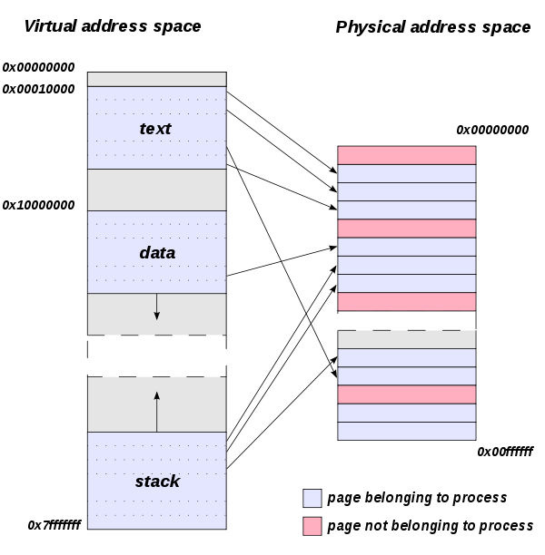
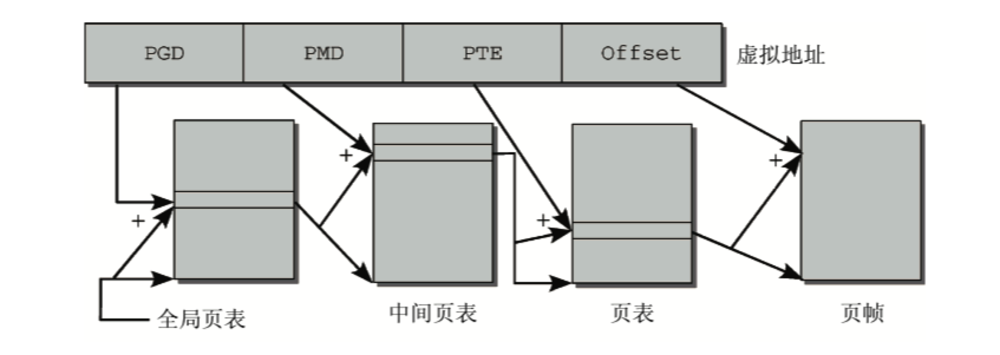

# 多级页表

虚拟存储器的基本思想是：程序、数据和堆栈的总大小可能超过可用的物理内存的大小。由操作系统把程序当前使用的那些部分保留在主存中，而把其他部分保存在磁盘上。

- 页帧：物理内存页称为`页帧`。
- 页：虚拟地址空间的页称之为`页`。

---

页表：表示虚拟地址空间和物理内存的`映射`的数据结构。实现两个地址空间的关联最容易的方法是使用`数组`，对虚拟地址空间中的每一页都分配一个数组项。但是每个进程都需要自身的页表，没有办法把所有的页表都放在内存里。

- 全局页目录：索引`中间页目录`。
- 中间页目录：索引进程的`页表数组`。
- 页表数组：进程`页表`的索引。
- 偏移量：指向`页`内部的一个字节位置。

