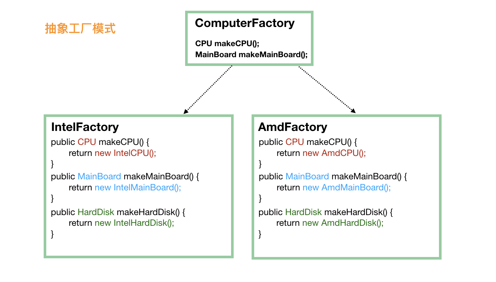

# 简单工厂、工厂模式和抽象工厂

## 简单工厂

```java
public class FoodFactory {

    public static Food makeFood(String name) {
        if (name.equals("noodle")) {
            Food noodle = new LanZhouNoodle();
            noodle.addSpicy("more");
            return noodle;
        } else if (name.equals("chicken")) {
            Food chicken = new HuangMenChicken();
            chicken.addCondiment("potato");
            return chicken;
        } else {
            return null;
        }
    }
}
```

## 工厂模式

```java
public interface FoodFactory {
    Food makeFood(String name);
}
public class ChineseFoodFactory implements FoodFactory {

    @Override
    public Food makeFood(String name) {
        if (name.equals("A")) {
            return new ChineseFoodA();
        } else if (name.equals("B")) {
            return new ChineseFoodB();
        } else {
            return null;
        }
    }
}
public class AmericanFoodFactory implements FoodFactory {

    @Override
    public Food makeFood(String name) {
        if (name.equals("A")) {
            return new AmericanFoodA();
        } else if (name.equals("B")) {
            return new AmericanFoodB();
        } else {
            return null;
        }
    }
}
```

## 抽象工厂



